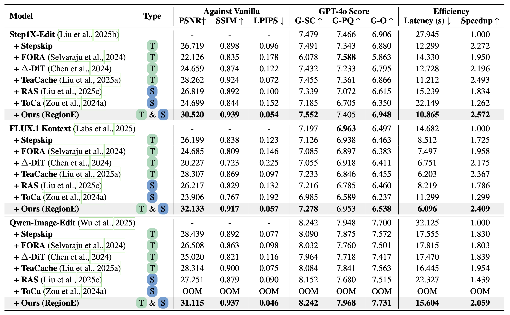

<!-- <div align= "center">
    <h1> Official repo for RegionE</h1>

</div> -->


<h2 align="center">
  
  <strong>RegionE: Adaptive Region-Aware Generation for Efficient Image Editing</strong>
</h2>

<div align="center">
<a href='https://arxiv.org/abs/2510.03065'></a> &nbsp;&nbsp;&nbsp;&nbsp;
</div>

## 🥳 What's New 
- [2025/10/15] 👋 Upload paper and init project. [Read]()


## 🏃 Overview
**RegionE** is an adaptive, region-aware generation framework that accelerates instruction-based image editing tasks without additional training. Specifically, the RegionE framework consists of three main components: **1) Adaptive Region Partition.**
We observed that the trajectory of unedited regions is straight, allowing for multi-step denoised predictions to be inferred in a single step. 
Therefore, in the early denoising stages, we partition the image into edited and unedited regions based on the difference between the final estimated result and the reference image. **2) Region-Aware Generation.**  After distinguishing the regions, we replace multi-step denoising with one-step prediction for unedited areas. 
For edited regions, the trajectory is curved, requiring local iterative denoising. To improve the efficiency and quality of local iterative generation, we propose the Region-Instruction KV Cache, which reduces computational cost while incorporating global information. 
**3) Adaptive Velocity Decay Cache.**
Observing that adjacent timesteps in edited regions exhibit strong velocity similarity, we further propose an adaptive velocity decay cache to accelerate the local denoising process.
<p align="center">
    
</p>
We applied RegionE to state-of-the-art instruction-based image editing models, including Step1X-Edit, FLUX.1 Kontext, and Qwen-Image-Edit. RegionE achieved acceleration factors of 2.57×, 2.41×, and 2.06×, respectively, with minimal quality loss (PSNR: 30.520–32.133). Evaluations by GPT-4o also confirmed that semantic and perceptual fidelity were well preserved.
<p align="center">
    
</p>

<!-- ## 🎥 Demo -->


## 🛠️ Dependencies and Installation
Begin by cloning the repository:
```shell
git clone https://github.com/Peyton-Chen/RegionE.git
cd RegionE
```

We recommend CUDA versions 12.4 or 12.1 for the manual installation.
```shell
# 1. Create conda environment
conda create -n regione python==3.10.18

# 2. Activate the environment
conda activate regione

# 3. Install PyTorch and other dependencies using pip
# For CUDA 12.1
pip install torch==2.5.1 torchvision==0.20.1 torchaudio==2.5.1 --index-url https://download.pytorch.org/whl/cu121
# For CUDA 12.4
pip install torch==2.5.1 torchvision==0.20.1 torchaudio==2.5.1 --index-url https://download.pytorch.org/whl/cu124

# 4. Install the latest version of diffusers
# For FLUX.1 Kontext or Qwen-Image-Edit
pip install git+https://github.com/huggingface/diffusers.git
# For Step1X-Edit
pip install git+https://github.com/Peyton-Chen/diffusers.git@step1xedit

# 5. Install pip dependencies
python -m pip install -r requirements.txt

# 6. Install flash attention v2 (optional)
python -m pip install git+https://github.com/Dao-AILab/flash-attention.git@v2.8.2
```

## 🎯 Quick Start
You can directly run the provided demo scripts under the [`scripts/`](./scripts) directory.

Alternatively, you can manually run the example command below:

### Step1X-Edit [🤗[Download Pretrained Model](https://huggingface.co/stepfun-ai/Step1X-Edit-v1p1-diffusers) ] 
```bash
python src/Step1X-Edit/main.py \
    --model_path stepfun-ai/Step1X-Edit-v1p1-diffusers \
    --num_inference_steps 28 \
    --use_regione \
    --warmup_step 6 \
    --post_step 2 \
    --refresh_step 16 \
    --threshold 0.88 \
    --cache_threshold 0.02 \
    --erosion_dilation \
    --guidance_scale 6.0 \
    --seed 110 \
    --device cuda \
    --image_path assets/data.json \
    --output_dir result/Step1X-Edit/Demo/RegionE
```

### FLUX.1 Kontext [🤗[Download Pretrained Model](https://huggingface.co/black-forest-labs/FLUX.1-Kontext-dev) ] 
```bash
python src/FluxKontext/main.py \
    --model_path black-forest-labs/FLUX.1-Kontext-dev \
    --num_inference_steps 28 \
    --use_regione \
    --warmup_step 6 \
    --post_step 2 \
    --refresh_step 16 \
    --threshold 0.93 \
    --cache_threshold 0.04 \
    --erosion_dilation \
    --guidance_scale 2.5 \
    --seed 110 \
    --device cuda \
    --image_path assets/data.json \
    --output_dir result/FluxKontext/Demo/RegionE
```

### Qwen-Image-Edit [🤗[Download Pretrained Model](https://huggingface.co/Qwen/Qwen-Image-Edit) ] 
```bash
python src/Qwen-Image/main.py \
    --model_path Qwen/Qwen-Image-Edit \
    --num_inference_steps 28 \
    --use_regione \
    --warmup_step 6 \
    --post_step 2 \
    --refresh_step 16 \
    --threshold 0.80 \
    --cache_threshold 0.03 \
    --erosion_dilation \
    --guidance_scale 4.0 \
    --seed 110 \
    --device cuda \
    --image_path assets/data.json \
    --output_dir result/Qwen-Image/Demo/RegionE
```
## 📝 Evaluation
### 1. Load Benchmark
RegionE was evaluated on [Kontext-Bench](https://huggingface.co/datasets/black-forest-labs/kontext-bench) or [GEdit-Bench](https://huggingface.co/datasets/stepfun-ai/GEdit-Bench), and the following is the script for obtaining the benchmark data.
```bash
bash script/load_data.sh
```

### 2. Batch Image Generation
For Step1X-Edit,
```bash
# Vanilla
python src/Step1X-Edit/main.py \
    --model_path stepfun-ai/Step1X-Edit-v1p1-diffusers \
    --num_inference_steps 28 \
    --guidance_scale 6.0 \
    --seed 110 \
    --device cuda \
    --evaluation \
    --image_path data/Processed/GEdit-Bench/en \
    --output_dir result/Step1X-Edit/Pretrain

# + RegionE
python src/Step1X-Edit/main.py \
    --model_path stepfun-ai/Step1X-Edit-v1p1-diffusers \
    --num_inference_steps 28 \
    --use_regione \
    --warmup_step 6 \
    --post_step 2 \
    --refresh_step 16 \
    --threshold 0.88 \
    --cache_threshold 0.02 \
    --erosion_dilation \
    --guidance_scale 6.0 \
    --seed 110 \
    --device cuda \
    --evaluation \
    --image_path data/Processed/GEdit-Bench/en \
    --output_dir result/Step1X-Edit/RegionE
```

For FLUX.1 Kontext,
```bash
# Vanilla
python src/FluxKontext/main.py \
    --model_path black-forest-labs/FLUX.1-Kontext-dev \
    --num_inference_steps 28 \
    --guidance_scale 2.5 \
    --seed 110 \
    --device cuda \
    --evaluation \
    --image_path data/Processed/Kontext-Bench \
    --output_dir result/FluxKontext/Pretrain

# + RegionE
python src/FluxKontext/main.py \
    --model_path black-forest-labs/FLUX.1-Kontext-dev \
    --num_inference_steps 28 \
    --use_regione \
    --warmup_step 6 \
    --post_step 2 \
    --refresh_step 16 \
    --threshold 0.93 \
    --cache_threshold 0.04 \
    --erosion_dilation \
    --guidance_scale 2.5 \
    --seed 110 \
    --device cuda \
    --evaluation \
    --image_path data/Processed/Kontext-Bench \
    --output_dir result/FluxKontext/RegionE
```
For Qwen-Image-Edit,
```bash
# Vanilla
python src/Qwen-Image/main.py \
    --model_path Qwen/Qwen-Image-Edit \
    --num_inference_steps 28 \
    --guidance_scale 4.0 \
    --seed 110 \
    --device cuda \
    --evaluation \
    --image_path data/Processed/GEdit-Bench/en \
    --output_dir result/Qwen-Image/Pretrain

# + RegionE
python src/Qwen-Image/main.py \
    --model_path Qwen/Qwen-Image-Edit \
    --num_inference_steps 28 \
    --use_regione \
    --warmup_step 6 \
    --post_step 2 \
    --refresh_step 16 \
    --threshold 0.80 \
    --cache_threshold 0.03 \
    --erosion_dilation \
    --guidance_scale 4.0 \
    --seed 110 \
    --device cuda \
    --evaluation \
    --image_path data/Processed/GEdit-Bench/en \
    --output_dir result/Qwen-Image/RegionE
```

### 3. Metric Evaluation

The evaluation scripts for PSNR, SSIM and LPIPS are as follows:

``` shell
python evaluation/metric_all_task.py \
--folder1 result/Step1X-Edit/Pretrain \
--folder2 result/Step1X-Edit/RegionE
``` 
The evaluation scripts for GPT4o-Score are as follows (please refer to [EVAL](./evaluation/GEdit-Bench/EVAL.md)):

``` shell
cd evaluation/GEdit-Bench
python run_gedit_score.py \
    --backbone="gpt4o" \
    --instruction_language="en" \
    --task_type="all" \
    --edited_images_dir="../../result/Step1X-Edit/RegionE" \
    --source_img_dir="../../data/Processed/GEdit-Bench/en" \
    --model_name="RegionE"
``` 


The folder structure of this project should look like:
```shell
RegionE/
├── assets/
├── data/
│   ├── GEdit-Bench/
│   ├── Kontext-Bench/
│   ├── Processed/
│   └── preprocess.py
├── evaluation/
│   ├── GEdit-Bench/
│   ├── metric_all_task.py
│   └── merge_metric.py
├── src/
│   ├── Step1X-Edit/
│   │    ├── fused_kernels.py
│   │    ├── inplace.py
│   │    ├── main.py
│   │    └── utils.py
│   ├── Qwen-Image/
│   └── FluxKontext/
├── result/
│   ├── Step1X-Edit/
│   │    ├── RegionE/
│   │    │   ├── background_change/
│   │    │   │   ├── generation/
│   │    │   │   │   ├── 0f385bcff859231789a9c978cafecc2a.png
│   │    │   │   │   ├── 1e6d1fa7e02689ee2409aa686132cab1.png
│   │    │   │   └── └── ...
│   │    │   ├── color_alter/
│   │    │   ├── material_alter/
│   │    │   └── ...
│   │    └── Pretrain/
│   ├── Qwen-Image/
│   └── FluxKontext/
├── script/
├── requirements.txt
└── README.md
``` 

## 💫 Acknowledgments
We thank the following excellent open-source works: [Step1X-Edit](https://github.com/stepfun-ai/Step1X-Edit), [FLUX.1 Kontext](https://github.com/black-forest-labs/flux), [Qwen-Image](https://github.com/QwenLM/Qwen-Image) and [RAS](https://github.com/microsoft/RAS).


## 🔗 Citation

```BibTeX
@article{chen2025regione,
  title   = {RegionE: Adaptive Region-Aware Generation for Efficient Image Editing},
  author  = {Pengtao Chen and Xianfang Zeng and Maosen Zhao and Mingzhu Shen and Peng Ye and Bangyin Xiang and Zhibo Wang and Wei Cheng and Gang Yu and Tao Chen},
  journal = {arXiv preprint arXiv:25xx.xxxx},
  year    = {2025}
}
```
